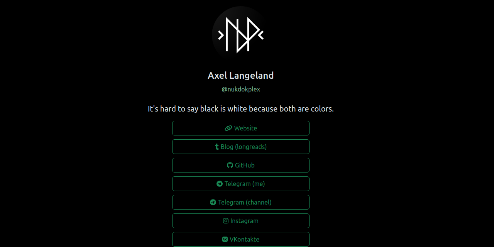

# NukDokPlex's Links (Linktree alternative)

Yet another incarnation of Linktr.ee built with React and Bootstrap.

## Before

Just clone, and run `npm ci` to clean install required packages.

## Customize

Just open file `src/data.json` and replace it with your info. Also you can customize css files. `src/custom.scss` is used to customize bootstrap.

## Debug

You can launch React dev server by running `npm run start`. Hot reload is present.

## Build

Just run `npm run build` and builded artifact will be available at `./build`.

## License

This project is licensed under [The MIT License](LICENSE.md)